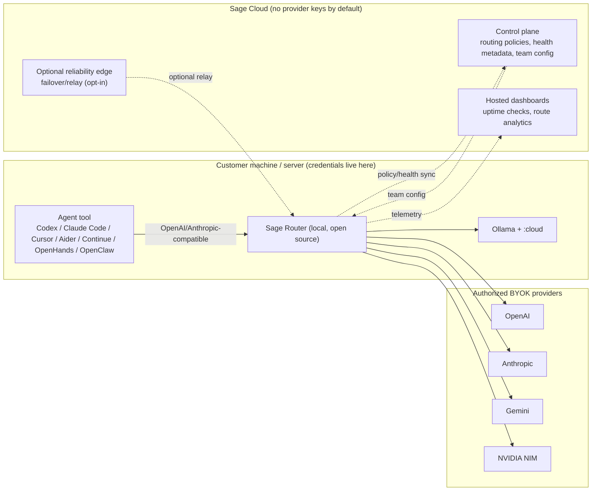

# Sage Router architecture

## Design principle

Default architecture should **physically prevent** Sage hosted infrastructure from harvesting customer provider keys. Provider credentials stay on the customer's machine or server. Hosted infrastructure stores routing policies, health metadata, team config, docs, and deployment helpers only.

## Components

## Request flow

1. An agent tool sends an OpenAI-compatible `/v1/chat/completions` or Anthropic-compatible `/v1/messages` request to the local Sage Router endpoint (`http://localhost:8790`).
2. The router classifies the request (task type, agentic signals, tool use, context/vision, thinking mode) and scores candidate models from discovered providers against policy, capability, latency, and health.
3. It selects the best route and sends an ordered fallback chain. On provider failure, rate limit, or 5xx, it retries the next candidate sequentially with no mid-stream model handoff.
4. Route-event telemetry (selected model, attempts, elapsed, auth type, plan) is emitted locally and optionally synced to Sage Cloud analytics.
5. Provider credentials never leave the customer machine by default.

## Deployment topologies

- **Local only**: `python3 router.py --port 8790`. Works with no account.
- **Self-hosted server**: Docker Compose or systemd; same local-first custody.
- **Tailnet edge**: a CDN-style edge proxy health-checks Tailnet Sage Router installs and routes to the lowest-latency healthy node. Credentials stay on the private routers. See [deploy/tailnet-edge](../deploy/tailnet-edge/README.md).
- **Public API (`api.sagerouter.dev`)**: Cloudflare-proxied GCP edge VM in front of Tailnet installs + the Google-hosted Sage Router API origin. Customer auth, billing, rate limits, and customer API key issuance live in front of the edge.

## Custody boundary

- **Local router**: holds provider credentials, executes routing, performs fallback.
- **Sage Cloud**: routing policies, health metadata, team config, dashboards, uptime checks. No provider keys by default.
- **Optional hosted relay/proxy**: encrypted-at-rest secrets only when explicitly enabled by the customer.

## Billing boundary

Sage Cloud monetizes convenience and reliability, not model resale. Plans: `free`, `lite` ($6/mo), `pro` ($30/mo), `max` ($72/mo), plus usage-based metered. See [docs/agent-native-pricing.md](agent-native-pricing.md). Checkout and billing portal are live at `api.sagerouter.dev/billing/stripe/checkout` and `/billing/stripe/portal`.
